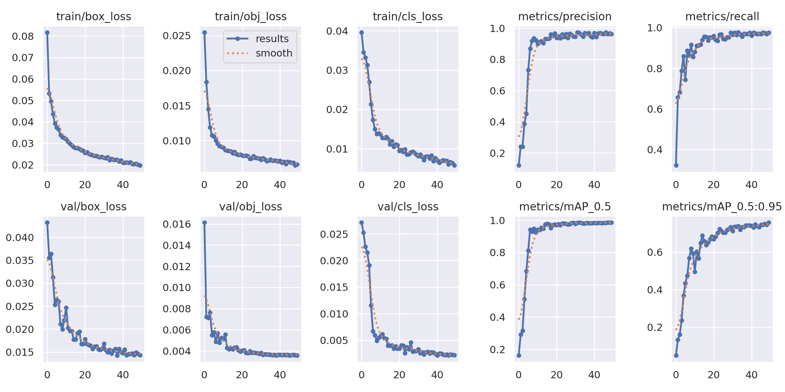
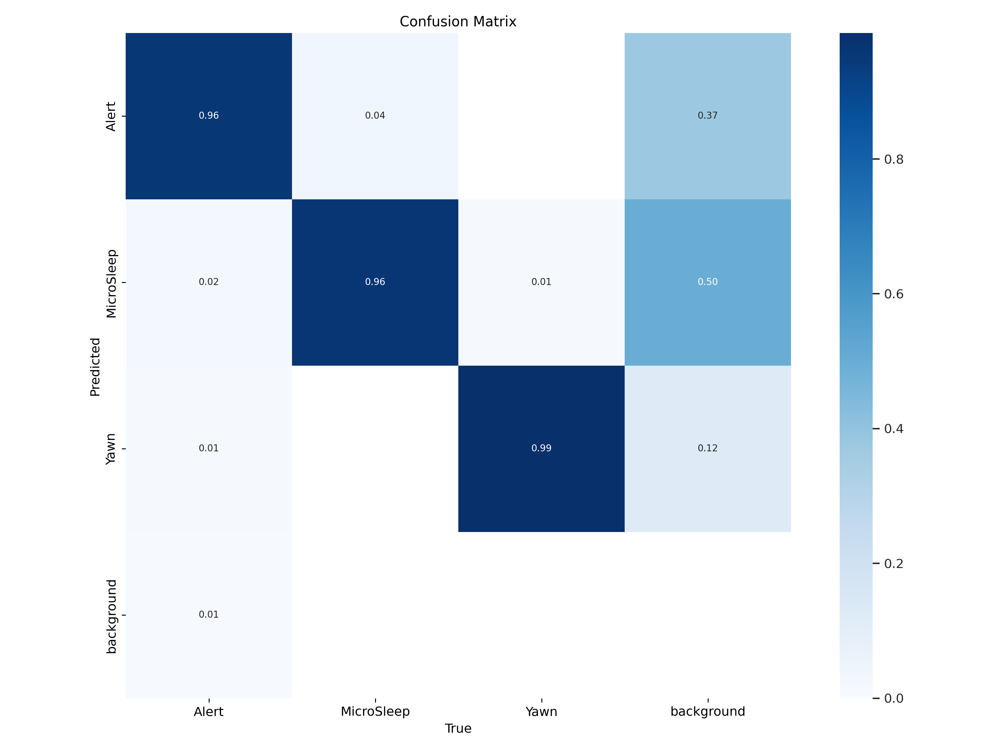
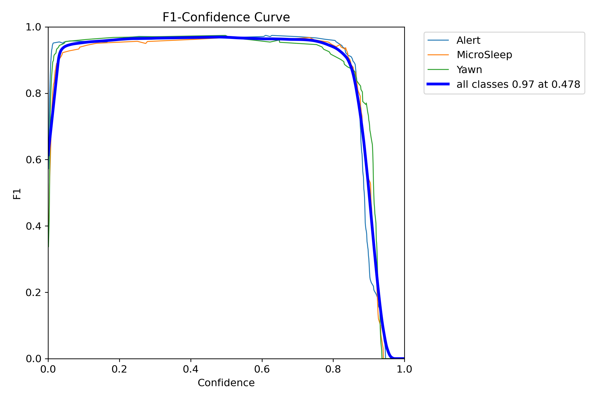

# jetson-nano-drowsiness-detection

[](https://github.com/ultralytics/yolov5)
[](https://developer.nvidia.com/embedded/learn/get-started-jetson-nano-devkit)
[](#)

This project implements a real-time behavioral monitoring system designed to detect driver fatigue. By leveraging the **YOLOv5n** architecture and optimizing it for edge deployment, the system classifies driver states into three categories: **Alert**, **Yawn**, and **MicroSleep**, triggering visual and auditory alerts when danger is detected.

## 📂 Directory Structure

```text
.
├── dataset/                   # Structured YOLOv5 dataset
│   ├── data.yaml              # Class names and path configurations
│   ├── train/                 # Training images & labels
│   ├── test/                  # Test images & labels
│   └── valid/                 # Validation images & labels
├── docs/                      # Project Documentation
│   ├── CS324_Project_Report.pdf
│   ├── CS324_Project_Run_Instructions.pdf
│   └── CS324_Project_Slides.pptx
├── icons/                     # UI Assets for Alerts
│   ├── coffee.jpg             # Yawn warning icon
│   └── warning.jpg            # MicroSleep alert icon
├── models/                    # Model definition logic
│   ├── yolov5n_drowsy.yaml    # Custom architecture config
│   └── yolo.py                # Core YOLOv5 model logic
├── runs/                      # Training outputs
│   └── train/
│       └── drowsiness_yolov5/ # Artifacts: weights, curves, metrics
├── utils/                     # Helper functions (augmentation, plots)
├── yolov5/                    # YOLOv5 Submodule
├── detect.py                  # Inference script with Alert Logic
├── train.py                   # Training & ONNX Export script
├── run.sh                     # Shell script for quick execution
├── requirements.txt           # Python dependencies
└── yolov5n.pt                 # Pre-trained base weights
```

## 🧠 Methodology

### 1. Model Selection
We utilized **YOLOv5n (Nano)**, the most lightweight variant of the YOLOv5 family. It features ~1.9 million parameters, making it ideal for the limited RAM and computational power of the NVIDIA Jetson Nano.

### 2. Transfer Learning
The model was fine-tuned from a checkpoint pre-trained on the COCO dataset. This allowed the system to inherit robust low-level feature extractors (edges, textures) and adapt upper layers specifically to facial features indicative of fatigue.

### 3. Classification States
- **Alert:** Normal, attentive driving behavior.
- **Yawn:** Early sign of fatigue; triggers a "WARNING" (Yellow).
- **MicroSleep:** Dangerous momentary loss of consciousness; triggers a "DROWSY" Alert (Red + Audio).

## 📊 Results & Evaluation

The system was evaluated based on training convergence, classification accuracy, and real-time hardware performance. The model achieved production-grade results, demonstrating high reliability for critical safety applications.

### 1. Key Performance Metrics
After training for 50 epochs, the YOLOv5n model reached the following benchmarks on the validation set:

| Metric | Value |
| :--- | :--- |
| **mAP@0.5** | 98.5% |
| **mAP@0.5:0.95** | 75.8% |
| **Precision** | 96.3% |
| **Recall** | 97.6% |

### 2. Training Dynamics



The training process followed three distinct phases:
*   **Initial Phase (Epochs 0-10):** Rapid convergence due to transfer learning. mAP@0.5 jumped from 16.1% to 94.2% as the model adapted its COCO-pretrained weights to facial features.
*   **Refinement Phase (Epochs 10-30):** Significant improvement in localization. mAP@0.5:0.95 increased from 49.5% to 71.4%, narrowing the gap between predicted and ground-truth boxes.
*   **Steady State (Epochs 30-50):** Fine-grained optimization. Loss values reached their floor (Box Loss: 0.020, Class Loss: 0.006).

### 3. Confusion Matrix and F1-Curve
 
| Confusion Matrix | F1-Curve |
| :---: | :---: |
|  |  |
| *Strong diagonal values indicate minimal confusion between classes.* | *Peak F1 is achieved at a 0.478 confidence threshold, with a high-performance plateau extending from 0.2 to 0.7, offering a flexible and stable range for deployment.* |

### 4. Edge Hardware Performance (Jetson Nano)
While the model achieves high accuracy, its primary success is efficiency on the **NVIDIA Jetson Nano**:
*   **Inference Speed:** Sustained **15-20 FPS** using the optimized ONNX pipeline.
*   **Latency:** Total end-to-end processing (capture to alert) stays within **50-70ms**, well under the threshold required for immediate driver notification.
*   **Optimization:** Achieved through the use of the `Nano` variant of YOLOv5 (1.9M parameters) and half-precision (FP16) inference where available.


## 🚀 Setup & Execution Guide (Jetson Nano)

Follow these steps to set up the environment, prepare the data, and run the detection.

### 1. Environment Setup
Clone the repository and install dependencies. It is recommended to use a Jetson-optimized environment with PyTorch and Torchvision pre-installed via JetPack.

```bash
# Clone the repository
git clone <your-repo-link>
cd <repo-name>

# Install python dependencies
pip install -r requirements.txt
```

### 2. Dataset Acquisition
We use a specialized drowsiness dataset from Roboflow.
1. Download the dataset in **YOLOv5 PyTorch format** from [Roboflow Universe](https://universe.roboflow.com/projects-7idri/drowsiness-detection-2-dcuql/dataset/1).
2. Unzip the folder and rename it to `dataset`.
3. Ensure `dataset/data.yaml` points to the correct absolute paths.

### 3. Training & Exporting
Run the training script. This script is configured to:
- Disable WandB (offline mode).
- Train for 50 epochs.
- **Automatically export** the best weights to `.onnx` for optimized inference.

```bash
python3 train.py
```
The trained model will be saved at: `runs/train/drowsiness_yolov5/weights/best.pt`.

### 4. Running Detection (Inference)
Connect a USB Webcam or CSI Camera to your Jetson Nano and run:

```bash
python3 detect.py --weights runs/train/drowsiness_yolov5/weights/best.pt --source 0 --hide-conf
```

**Key Flags:**
- `--source 0`: Uses the default webcam.
- `--weights`: Path to your trained `.pt` or `.onnx` file.
- `--hide-conf`: Cleans up the UI by hiding confidence percentages.

### 5. UI & Alerts
During detection, the system provides real-time feedback:
- **Normal (Blue Box):** No alert.
- **Yawn (Yellow Box + Coffee Icon):** Displayed when a yawn is detected.
- **Drowsy (Red Box + Warning Icon):** Displayed during MicroSleep. 
- **Sound:** The `playsound` library is used to trigger an audible alarm during MicroSleep events.

## 🛠 Optimization for Edge
To achieve the **15-20 FPS** observed on Jetson Nano:
1. **ONNX Export:** The `train.py` script exports the model to ONNX format, which allows for faster execution than raw PyTorch.
2. **Half-Precision:** Use the `--half` flag in `detect.py` if your Jetson supports FP16 for a significant speed boost.
3. **Resolution:** Inference is performed at `640x640` to maintain balance between accuracy and latency.

## 👥 Contributors
- **Southern University of Science and Technology (SUSTech)**
- Team: Jaouhara Zerhouni Khal, Saruulbuyan Munkhtur, Wai Yan Kyaw, Tan Hao Yang, Hok Lay Heng.

*Developed as part of CS324's final project: Demo AI on Chips.*

